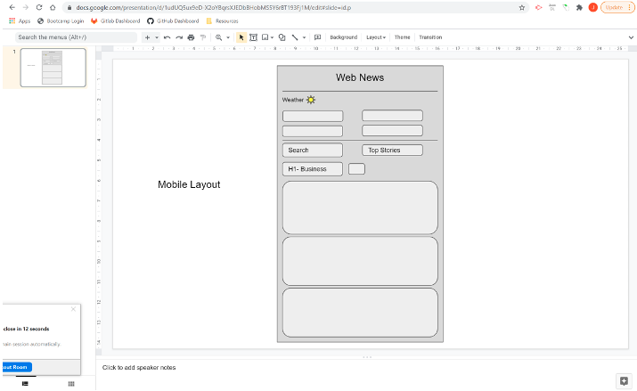
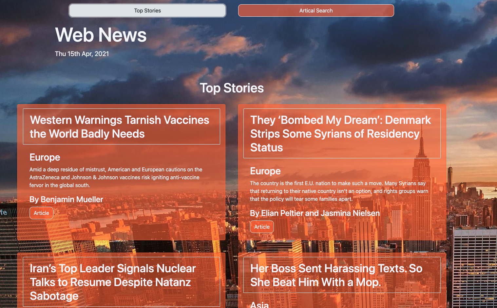
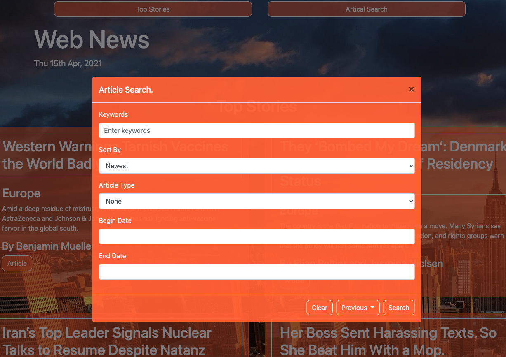
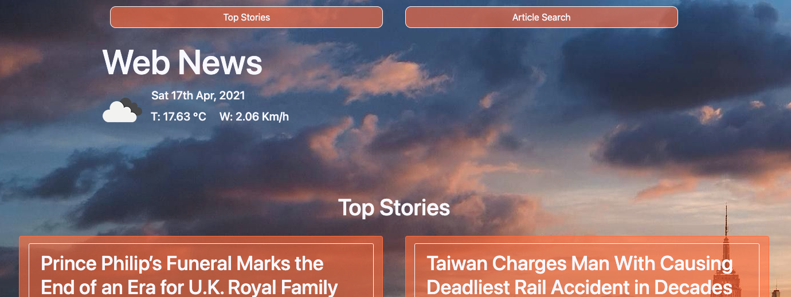

# Web News

To provide access to news on the go in a simple clean format via a web application that targets mobile users first.

# User Story

AS a professional who commutes for work and has a keen interest in keeping up with the latest news and weather.

I WANT to be able to access the news and weather on my mobile in a simple clean uncomplicated format.

SO THAT I can see the weather for the day, review the day’s top stories, and if i have additional time, search for articles of my choosing.

# Acceptance Criteria

GIVEN that I have opened the app.
THEN I’m presented with today’s 4 top stories and weather forecast – Icon, Temp and wind.

WHEN I search for a news article.
THEN the page refreshes and I’m presented with the 4 top articles for my search term.

WHEN I search for a news article.
THEN that search is saved as a quick access open on the screen.

WHEN I click the Top Stories Button.
THEN then page refreshes, and cycles through the top stories so that I can navigate away from my search results. 

# UI Draft

# Features

## Top Stories

Displays the day's top stories when a user opens the app, providing the user easy access to the top articles.

When the user clicks the Top Stories button, it cycles through the top news articles until the end is reached, then notifies the user once they have reached the end. 

## Article Search

Provides the user with the functionality to search for articles of their choice. Their searches are also saved for future use.

## Todays Weather

Displays the weather for the day based on the users GEO location.

# Setup Up

The user will require a New York Times account to access the articles.

# Future Development

* Expand the API to include additional news feeds which will allow the user to select their favourites, providing the user with a greater choice. The objective is to make the app a one stop shop for all the users news.
* Add a comments/forum section that allows users the discuss/debate tagged news articles, this will create a community around the app.

# Link to Git Hub
https://github.com/mp2626/news_app

# Link to Site

https://mp2626.github.io/news_app/

# Programming Languages/APIs

* HTML
* CSS
* JavaScript
* JQuery
* BootStrap
* MomentJS
* New York Times - Top Stories API
* New York Times - Article Search API
* Open Weather Map API

# Authors
Contributor - Michael Perrin
Contributor - Zhou Tian
Contributor - Peter Siapkas
Contributor - Joshua-Rhymer Bernardo
